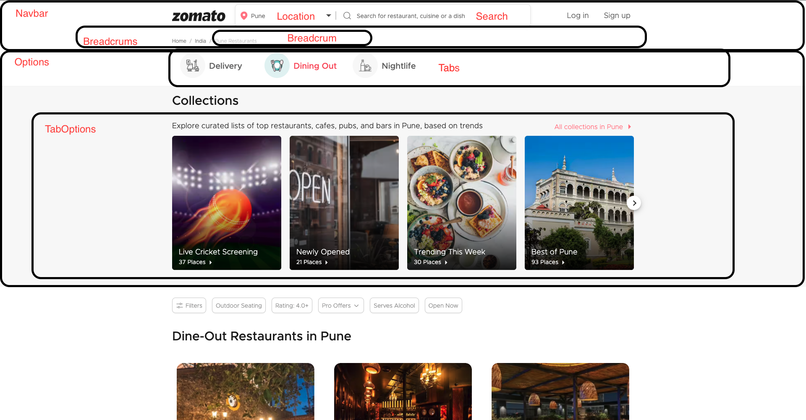

# Task

- Create a Similar page to [Zomato Pune Dineout](https://www.zomato.com/pune/dine-out)

# Getting Started

1. Clone/Fork this repository [https://github.com/riteshf/zomato-dine-out-pune-clone.git](https://github.com/riteshf/zomato-dine-out-pune-clone.git)
2. navigate to the folder `cd zomato-dine-out-pune-clone`
3. npm install
4. npm start

## Understand Page

## Understanding Component Structure

- [App](./src/App.js)
  - [Navbar](./src/components/Navbar/Navbar.jsx)
    - [ComboSearch](./src/components/Navbar/ComboSearch/ComboSearch.jsx)
      - [Location](./src/components/Navbar/ComboSearch/Location/Location.jsx)
      - [Search](./src/components/Navbar/ComboSearch/Search/Search.jsx)
    - [Breadcrums](./src/components/Navbar/Breadcrums/Breadcrums.jsx)
      - [Breadcrum](./src/components/Navbar/Breadcrums/Breadcrum/Breadcrum.jsx)
  - [Options](./src/components/Options/Options.jsx)
    - [Tabs](./src/components/Options/Tabs/Tabs.jsx)
      - [Tab](./src/components/Options/Tabs/Tab/Tab.jsx)
    - [TabOptions](./src/components/Options/TabOptions/TabOptions.jsx)
      - [TabOption](./src/components/Options/TabOptions/TabOption/TabOption.jsx)
  - [Restaurants](./src/components/Restuarants/Restaurants.jsx)
    - [Filters](./src/components/Restuarants/Filters/Filters.jsx)
      - [FilterButton](./src/components/Restuarants/Filters/FilterButton/FilterButton.jsx)
    - [Restaurant](./src/components/Restuarants/Restuarant/Restaurant.jsx)

**Note** - `Make sure you use only the given components and dont create new files and folders as chaging component name, structures might result in giving you zero marks`

## Understanding Data Structure

- [options.json](./src/data/options.json)
  - information of tab options and options to show when one tab option is selected.
- [restaurants.json](./src/data/restaurants.json)
  - inforamation on all the restaurants in system

**Note** - `Make sure you use only the given data and dont create new data, as chaging data might result in giving you zero marks`

## Features to build

1. `Tabs` Should be Sticky to top of page
   - When Scrolled below `Filters` filters should be sticky.
2. Make sure `Location` Dropdown works and give you the same option
3. `Search` should filter the restuarant by `restaurant.name`, case insensentive search.
4. User should be able to select only one `Tabs` from `Options`.
   - Default `Dining Out` should be selected.
5. `Filters` and `FilterButton` should be able to filter data with `Search` Feature.
6. `FilterButton` should filter as follows.
   - rating 4+ : Shows only restuarant with rating above 4.
   - open now : shows restuarant that are open now.
   - outdoor seating: shows restaurants that has outdoor seating.
   - searves alcohol - shows restaurant that serves alcohol.
7. We should be able to Select multiple `FilterButton`.
8. By clicking on same `FilterButton` twice should de-select that FilterButton.

**Note** - `Make sure you implelement features one by one and deploy the app correctly`

## General Instructions (**_IMPORTANT_**)

1. Do not use Global CSS, instead use `<componentName>.module.css` convention.
2. Do Not Remove `data-cy="xxxx"` from anywhere, this are used by testing tools to test your code, removal of this will lead to low score.
